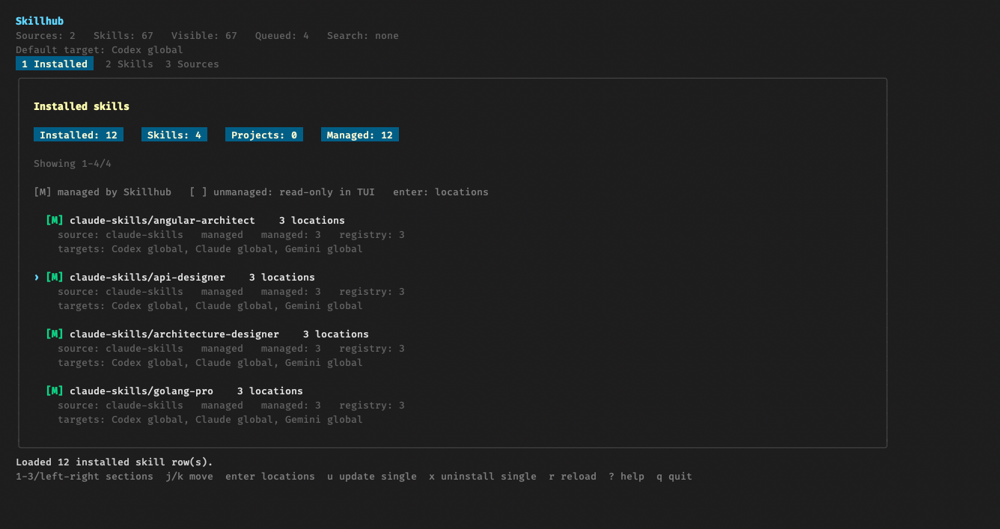
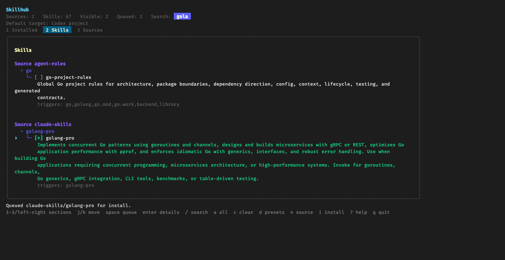

# Skillhub

Skillhub is a Go CLI and Bubble Tea TUI for discovering, recommending,
installing, updating, and restoring agent skills from configured sources.

The runtime backend lives in `internal/core`. The Cobra CLI in `internal/cli`
and the TUI in `internal/tui` call that backend directly.

## Install

Requirements: Go and Git.

```sh
curl -fsSL https://raw.githubusercontent.com/assurrussa/skillhub/main/install.sh | sh
```

The installed `skillhub` command is a standalone Go binary. It embeds the
default source presets and target registry, so normal commands and the TUI do
not need `SKILLHUB_REPO` or a live checkout at runtime.

From a checkout:

```sh
sh install.sh
go run ./cmd/skillhub version
```

Useful installer overrides:

```sh
sh install.sh --bin-dir /tmp/bin
sh install.sh --global
SKILLHUB_BIN_DIR=/tmp/bin sh install.sh
SKILLHUB_HOME=/tmp/skillhub-home sh install.sh
```

Open the TUI:

```sh
skillhub
skillhub tui
```

## Quick Start

Fresh installs have no active sources. Add a recommended preset first:

```sh
skillhub sources defaults list
skillhub sources defaults add agent-rules
skillhub sources status
skillhub sources sync agent-rules
skillhub skills list
skillhub search go
skillhub install agent-rules/go-project-rules
```

Initialize a repository with project-local skills:

```sh
skillhub recommend --project .
skillhub install --target codex --scope project --project . \
  agent-rules/go-project-rules \
  agent-rules/docs-project-rules \
  agent-rules/project-workflow-rules
skillhub restore --check --project .
```

## Sources

Active sources are user config, not repository state:

```text
${XDG_CONFIG_HOME:-$HOME/.config}/skillhub/sources.tsv
```

Git source checkouts and generated catalogs are cached under:

```text
${SKILLHUB_CACHE_DIR:-$HOME/.cache/skillhub}
```

Catalog reads are cache-first. `skills list/search`, `recommend`, ordinary
`install`, and the TUI Skills screen do not implicitly fetch, clone, or pull.
Use `skillhub sources sync [source]` or the TUI Sources screen when you need
fresh data.

Supported source layouts:

- native `catalog/skills.tsv` plus `skills/<name>/SKILL.md`
- nested `skills/**/SKILL.md`, materialized as path-prefixed names
- plugin bundles at `plugins/<plugin>/skills/**/SKILL.md`; generated installs
  use the upstream name when it does not occupy the legacy ID namespace
- root-level `SKILL.md` or `<name>/SKILL.md`

Generated catalogs reserve historical path-prefixed IDs before assigning shorter
names. An existing ID never changes which skill it resolves to during update or
restore. Plugin names containing `_` retain their path prefix, even before a
collision exists: `a/foo` is listed as `foo` with hidden legacy alias `a_foo`,
while `b/a_foo` remains `b_a_foo`. If multiple skills prefer the same shorter
name, historical owners keep their path-prefixed IDs instead of making the
source unusable. Hidden aliases are accepted explicitly and in
existing metadata/lockfiles, but are excluded from discovery and `install --all`.
Ambiguous historical IDs are rejected, not silently rebound. Legacy path-prefixed
installs preserve the upstream `SKILL.md` content.

Older generated caches are rebuilt from the local source checkout when their
naming-policy version changes. This does not fetch from the network; a missing
checkout must first be restored with `skillhub sources sync <source>`.

Examples:

```sh
skillhub sources add https://github.com/mattpocock/skills --name mattpocock
skillhub sources add https://github.com/onmax/nuxt-skills
skillhub sources defaults add humanlayer-skills
skillhub sources defaults add stitch-skills
skillhub sources add ../agent-rules --name local-agent-rules
skillhub install mattpocock/engineering_tdd --target codex --scope global
skillhub install stitch-skills/stitch-design_generate-design --target codex --scope global
```

For GitHub repositories added without `--name`, Skillhub derives a collision-
resistant lower-case source ID from `<owner>-<repo>`. For example,
`https://github.com/onmax/nuxt-skills` becomes `onmax-nuxt-skills` and
`https://github.com/humanlayer/skills` becomes `humanlayer-skills`. Existing
configured aliases are not renamed automatically. Explicit `--name` always
wins.

Skillhub installs individual skill directories from plugin-bundle sources. It
does not install or manage Codex plugins or plugin marketplace entries.
Source names are case-insensitive on input and stored as lower-case IDs.

Source rename requires an inspectable local source path or Git checkout. Restore
an unavailable path or run `skillhub sources sync <old-name>` before renaming.
For unnamed root skills whose IDs derive from the source alias, rename checks
the proposed catalog IDs and installation destinations before changing any
registry entries, sidecars, lockfiles, or installed directories. A conflict
rejects the operation and leaves the old source and installations unchanged.

GitHub tree URLs are normalized to repo URL plus ref:

```sh
skillhub sources add https://github.com/example/skills-repo/tree/agent-skills/skills/ --name example
```

For local development of the bundled preset:

```sh
SKILLHUB_AGENT_RULES_PATH=../agent-rules skillhub skills list
```

## Targets And Metadata

Targets are defined in `targets/targets.tsv`.

Supported install targets:

- `codex --scope global`: `~/.agents/skills`
- `codex --scope project`: `<project>/.agents/skills`
- `claude --scope global`: `~/.claude/skills`
- `claude --scope project`: `<project>/.claude/skills`
- `gemini --scope global`: `~/.gemini/skills`
- `gemini --scope project`: `<project>/.gemini/skills`
- `antigravity --scope global`: `~/.gemini/antigravity/skills`
- `antigravity --scope project`: `<project>/.agents/skills`
- `opencode --scope global`: `~/.config/opencode/skills`, or
  `$OPENCODE_CONFIG_DIR/skills`
- `opencode --scope project`: `<project>/.opencode/skills`
- `directory --dir <path>`: explicit skills directory

Global and custom-directory installs write sidecar metadata:

```text
<target-root>/<skill>/.skillhub.json
```

Project-scope installs do not write machine-local sidecar metadata. Their
managed state is recorded in:

```text
${XDG_CONFIG_HOME:-$HOME/.config}/skillhub/installed.tsv
```

Project-scope installs also write a portable project lockfile:

```text
<project>/skills.lock.toml
```

`skills.lock.toml` uses project-relative paths and stores source location,
source type, ref, catalog, target, installed path, hash, and timestamps. Restore
uses this lockfile directly and does not add sources to user config.

Skillhub only updates or uninstalls managed directories by default. It refuses
to overwrite or remove unmanaged skill directories unless an uninstall command
uses `--force`.

## TUI

Primary TUI sections:

- `1 Installed`: managed and unmanaged local skill directories
- `2 Skills`: cached catalog search and install queue
- `3 Sources`: source status, presets, custom sources, and sync actions
- `? Help`: update commands and project lockfile restore

Common keys:

```text
1/2/3      switch sections
left/right switch sections
j/k        move
space      queue or toggle
enter      open or confirm
/          search skills
i          install queued skills
u          update highlighted install/source
U or s     update all sources in Sources
e          rename highlighted source across dependencies in Sources
x          uninstall highlighted managed skill / remove source
r          reload; in Help, restore project lockfile
?          help
q          quit
```





Self-update remains CLI-only:

```sh
skillhub update
skillhub update --cascade
skillhub update --cascade -v
```

`skillhub update` prints the currently running version before rebuilding and
the newly installed version after rebuilding. Without `--bin-dir`, it updates
the directory of the currently running `skillhub` executable.

`--cascade` updates Skillhub, then managed target installs, then project-scope
usage rows recorded in `installed.tsv`.

## Command Reference

Sources:

```sh
skillhub sources list
skillhub sources status --tsv
skillhub sources sync agent-rules
skillhub sources defaults list
skillhub sources defaults add agent-rules
skillhub sources add ../agent-rules --name local-agent-rules
skillhub sources rename local-agent-rules my-agent-rules
skillhub sources remove my-agent-rules
skillhub sources remove my-agent-rules --force
```

Catalog and install:

```sh
skillhub list
skillhub search go
skillhub install rules-selector
skillhub add rules-selector
skillhub skills install --all
skillhub skills install rules-selector --target codex --scope project --project /path/to/project
skillhub skills install rules-selector --target directory --dir /tmp/skills
```

Installed skills and project state:

```sh
skillhub installed list
skillhub installed list --target claude --scope project --project /path/to/project
skillhub installed update
skillhub installed update --target directory --dir /tmp/skills -v
skillhub installed usage
skillhub installed usage agent-rules/go-project-rules --tsv
skillhub installed usage update --projects
skillhub installed uninstall rules-selector
skillhub installed uninstall rules-selector --target directory --dir /tmp/skills
```

Project restore and recommendations:

```sh
skillhub recommend --project /path/to/project
skillhub recommend --project /path/to/project --tsv
skillhub restore --project /path/to/project
skillhub restore --check --project /path/to/project
skillhub restore --check --project /path/to/project --tsv
```

Targets:

```sh
skillhub targets list
skillhub targets detect
skillhub targets detect --tsv --project /path/to/project
```

## Development

Project-specific agent instructions live in `AGENTS.md`.

Preferred checks:

```sh
make verify
make smoke-temp
make tui-temp
```

Equivalent raw commands:

```sh
go run ./cmd/skillhub-dev verify
go run ./cmd/skillhub-dev smoke-temp
go run ./cmd/skillhub-dev tui-temp
```

Focused checks:

```sh
go test ./...
go vet ./...
git diff --check
golangci-lint run ./...
```
